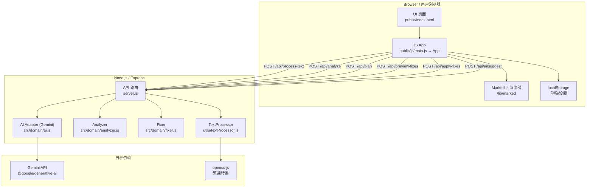
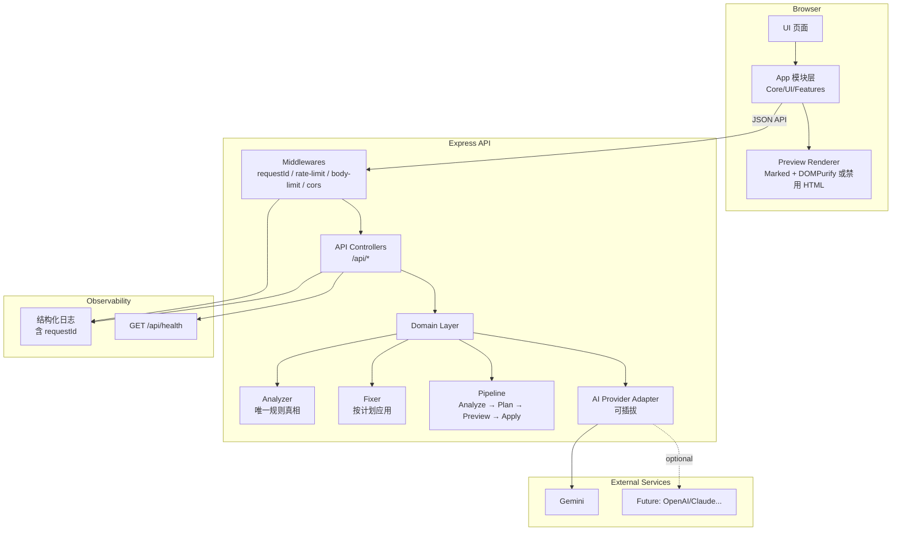

# 项目架构图（Mermaid）

> 说明：该图描述当前实现（As-Is）与建议演进（To-Be）两个视角，便于你审阅上线改造范围。

## 1) As-Is（当前代码结构）

对应入口与关键模块：[`server.js`](server.js:1)、[`TextProcessor.processText()`](utils/textProcessor.js:32)、[`analyze()`](src/domain/analyzer.js:174)、[`applyFixes()`](src/domain/fixer.js:3)、[`AI.suggest()`](src/domain/ai.js:23)、[`public/js/main.js`](public/js/main.js:1)

---

## 2) To-Be（建议上线后架构：契约统一 + 安全加固）

该 To-Be 的具体落地计划参见：[`docs/PRODUCTION_READINESS_PLAN.md`](docs/PRODUCTION_READINESS_PLAN.md:1)

